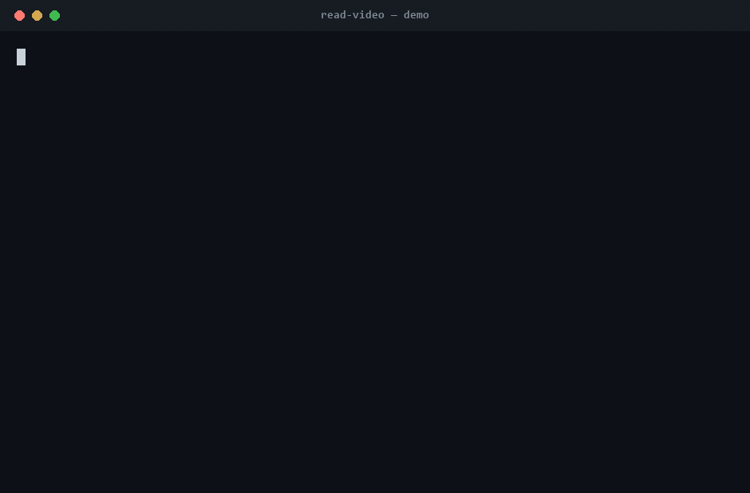

# read-video

A [Claude Code](https://claude.com/claude-code) **skill** that lets Claude actually *read* a video — a
local file or a URL (YouTube / Loom / …) — and answer questions about it, with a **cost pre-flight gate**
so you always see the price before any work happens.

> Claude's `Read` tool renders images and PDFs, but **not video**. So "reading a video" means turning it
> into things Claude *can* read: **frames** (JPGs → the visual channel) and a **transcript** (audio → text).
> The expensive part is usually Claude's own token usage (frames dominate), so this skill prices the whole
> job up front and lets you decide go / skip.



---

## Why it exists

Three problems show up the moment you try to get an AI agent to "watch" a video:

1. **It can't see video at all.** You have to decompose it into frames + audio yourself.
2. **It's silently expensive.** A 13-minute clip at 2 fps is hundreds of vision-heavy frames — that can cost
   more in agent tokens than you'd guess. You want a number *before* you commit.
3. **Audio is sensitive.** The cheap, accurate transcription paths are cloud APIs — which means your audio
   leaves the machine. Sometimes that's fine; often it isn't. The default should be local and private.

`read-video` answers all three: it extracts only the frames worth looking at (adaptive budget), it shows a
full cost breakdown at a **gate** before spending, and it defaults to **free, local, offline** transcription
(`faster-whisper`) — only reaching for a paid API after you approve it.

## Features

- **Local files and URLs** — `.mp4/.mov/.mkv/.webm/...` and YouTube/Loom/etc. via `yt-dlp`.
- **Two channels, pick what's worth it** — `--tier visual` (frames), `audio` (transcript), or `both`.
- **Cost gate** — `estimate` prices transcription **$** vs agent-token **$** separately, names the dominant
  driver, and flags any out-of-pocket spend or one-time install *before* it happens.
- **Pluggable transcription backends**, cheapest-and-most-private first:
  sidecar `.srt`/`.vtt` → URL captions → local `faster-whisper`/`trx` → Groq → OpenAI → OpenRouter → Gemini.
- **No SDKs for the paid paths** — uploads are pure-stdlib `urllib` (hand-built multipart), so Groq/OpenAI
  work with just an env var, no `pip install`.
- **Offline-resilient local transcription** — cached Whisper models load with `local_files_only=True`
  (skips the network revision check that fails on locked-down networks) and fall back gracefully with a loud
  warning instead of silently degrading.
- **Privacy by default** — keys are read **only** from environment variables; the skill never scans or loads
  `.env` files. Audio never leaves the machine unless you explicitly approve a cloud backend at the gate.
- **Optional vault workspace** — point it at an inbox folder + an output folder and it resolves bare
  filenames and auto-saves the finished note.

## How it works (60-second version)

```
            ┌─────────┐   ┌──────────┐   ┌───────────┐   ┌──────────┐   ┌────────┐
 input ───► │  probe  ├──►│ estimate ├──►│ COST GATE ├──►│   run    ├──►│  Read  ├──► grounded
 path/URL   │ ffprobe │   │  $ + tok │   │ go / skip │   │ frames + │   │ frames │    answer
            │ /yt-dlp │   │          │   │           │   │transcript│   │  + txt │   (TL;DR + [MM:SS])
            └─────────┘   └──────────┘   └───────────┘   └──────────┘   └────────┘
```

The engine (`skill/scripts/video.py`) is a small CLI with three subcommands — `probe`, `estimate`, `run`.
The skill (`skill/SKILL.md`) is the prompt that tells Claude how to drive them: probe → estimate → **show
the gate** → run only after the user agrees → `Read` the frames/transcript → answer.

Full detail: **[docs/architecture.md](docs/architecture.md)** · **[docs/workflow.md](docs/workflow.md)** ·
**[docs/cli-reference.md](docs/cli-reference.md)**.

## Install

### 1. System tools
- **ffmpeg / ffprobe** — frame + audio extraction. ([download](https://ffmpeg.org/download.html))
- **yt-dlp** — only needed for video URLs + captions. (`pip install yt-dlp` or a binary)

The **free local paths (visual frames + URL captions) need nothing else.**

### 2. The skill
Copy the `skill/` folder into your Claude Code skills directory as `read-video`:

```bash
# macOS / Linux
cp -r skill ~/.claude/skills/read-video
```
```powershell
# Windows
Copy-Item -Recurse skill "$env:USERPROFILE\.claude\skills\read-video"
```

Claude Code picks it up automatically. Invoke with `/read-video <path-or-url>` or just ask Claude to
"read / summarize / transcribe this video".

### 3. (Optional) local transcription
```bash
pip install faster-whisper      # local, $0, private — recommended for personal audio
```
First use downloads a model (default `small`, ≈ 484 MB). See [docs/backends](skill/references/backends.md).

### 4. (Optional) workspace
Copy `skill/workspace.example.json` to `workspace.json` **inside your installed skill directory**
(e.g. `~/.claude/skills/read-video/workspace.json` — gitignored, not tracked in this repo) and set
`inbox_dir` / `out_dir` to your folders. With it, you can pass **bare filenames** and the skill
auto-saves notes.

### 5. (Optional) other agent harnesses
`read-video` also works with Codex, Gemini CLI, and Copilot CLI — they share one install
directory (`~/.agents/skills/`) with the identical `SKILL.md` format Claude Code uses, so no
per-harness adapter is needed. Run the install script instead of the manual copy above to set up
all of them at once:

```powershell
# Windows / PowerShell
.\scripts\install-skill.ps1
```
```bash
# macOS / Linux / Git Bash
bash scripts/install-skill.sh
```

See [docs/harness-support.md](docs/harness-support.md) for details.

## Quickstart (driving the engine directly)

```bash
cd ~/.claude/skills/read-video

# 1. What is this?
python scripts/video.py probe "clip.mp4"

# 2. What would it cost to summarize it?  (the gate)
python scripts/video.py estimate "clip.mp4" --tier both --backend faster-whisper --human

# 3. Run it — extract frames + transcript into a workdir for Claude to Read
python scripts/video.py run "clip.mp4" --tier both --backend faster-whisper
```

`estimate --human` prints a readable cost table; everything else is JSON for the agent.

## Transcription backends

| Backend | `--backend` | ~$/min | Audio leaves machine? | Needs |
|---|---|---|---|---|
| Sidecar `.srt/.vtt` | (auto) | 0 | no | a transcript file next to the video |
| URL captions | `captions` | 0 | no | `yt-dlp` |
| **faster-whisper** | `faster-whisper` | 0 | **no** | `pip install faster-whisper` |
| trx | `trx` | 0 | no | `bun add -g @crafter/trx` |
| Groq | `groq` | ~0.0007 | yes | `GROQ_API_KEY` |
| OpenAI | `openai` / `openai-mini` | 0.006 / 0.003 | yes | `OPENAI_API_KEY` |
| OpenRouter | `openrouter` | 0.006 | yes | `OPENROUTER_API_KEY` |
| Gemini | `gemini` | ~0.037 | yes | `GEMINI_API_KEY` |

Details + setup: **[skill/references/backends.md](skill/references/backends.md)**.

## Validation

The skill was built and benchmarked with Claude Code's skill-creator eval loop (with-skill vs no-skill
baselines, graded on objective assertions). Iteration-1: **93.3% pass with the skill vs 66.7% baseline
(+0.27)**. Methodology + findings: **[docs/evals.md](docs/evals.md)**.

## Repo layout

```
read-video/
├── README.md                  ← you are here
├── LICENSE                    ← MIT
├── CREDITS.md                 ← prior art + dependencies
├── docs/
│   ├── architecture.md        ← how/why it's built this way (the cost model, channels, cascade)
│   ├── cli-reference.md       ← the engine "API": probe / estimate / run, flags, JSON shapes
│   ├── workflow.md            ← the agent decision flow + output contract
│   ├── evals.md               ← skill-creator eval methodology + results
│   └── harness-support.md     ← multi-harness install (Claude Code + Codex/Gemini CLI/Copilot CLI)
├── scripts/
│   ├── install-skill.ps1      ← installs skill/ to both ~/.claude/skills/ and ~/.agents/skills/
│   └── install-skill.sh       ← bash parity (macOS/Linux/Git Bash)
├── skill/                     ← the installable skill (copy → ~/.claude/skills/read-video/)
│   ├── SKILL.md
│   ├── scripts/video.py
│   ├── pricing.json
│   ├── references/backends.md
│   ├── evals/evals.json
│   └── workspace.example.json
└── samples/                   ← drop your own clips here (gitignored)
```

## Instagram capture (optional)

If you save job-hunting/AI/programming reels into an Instagram collection named **"courses"**, the
`/instagram-capture [N] [--dry-run]` Claude Code command (this repo's `.claude/commands/` +
`.claude/agents/`) can pull up to N of their URLs straight into `read-video`'s `inbox_dir/urls.md`
queue — a scoped subagent drives the browsing via `claude-in-chrome`, unsaving each reel only after
its URL is confirmed captured. Claude-Code-only (depends on the `claude-in-chrome` MCP tools); it
does not extend to the other harnesses `read-video` itself supports. Always dry-run first
(`--dry-run` — lists candidates, writes/unsaves nothing) before a live run, and watch the first
live run end-to-end. It never triggers `read-video` processing itself — run `probe`/`estimate`/`run`
against the populated queue separately, exactly as documented above.

## Contributing

Issues and PRs welcome — this is meant to improve over time. Good first areas: more backends, smarter
visual-change frame selection (vs fixed budget), Linux/macOS path testing, better non-English defaults.
See [CREDITS.md](CREDITS.md) for prior art and the dependency map.

## License

[MIT](LICENSE) © 2026 Richard Pillaca ([@RikepilB](https://github.com/RikepilB)). Inspired by
[bradautomates/claude-video](https://github.com/bradautomates/claude-video) — see [CREDITS.md](CREDITS.md).
